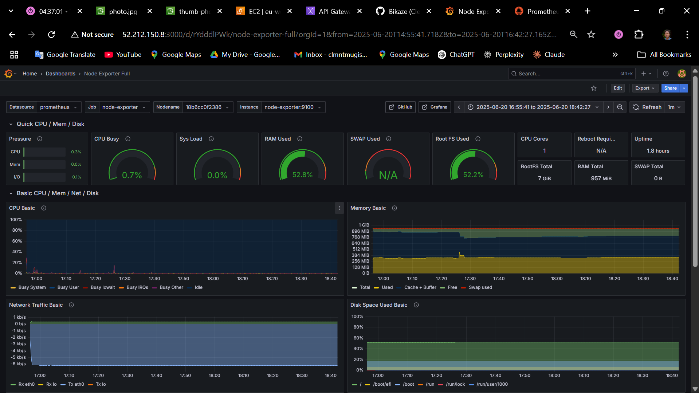

# Prometheus & Grafana DevOps Lab


## Project Overview

This repository contains my hands-on lab work with Prometheus and Grafana for monitoring system metrics. The lab was set up following the [Better Stack guide](https://betterstack.com/community/guides/monitoring/visualize-prometheus-metrics-grafana/).

## Setup Instructions

To replicate this monitoring environment:

1. Clone this repository
2. Make sure Docker and Docker Compose are installed
3. Run the stack with:
   ```bash
   docker compose up -d
   ```
4. Access Grafana at http://localhost:3000 (default credentials: admin/admin)
5. Access Prometheus at http://localhost:9090

## Assessment Questions and Answers

### Section 1: Architecture and Setup Understanding

#### Question 1: Container Orchestration Analysis


The Node Exporter container requires mounting host directories (`/proc`, `/sys`, `/`) to access crucial system metrics from the host machine. These mounts allow the Node Exporter to collect metrics about the host system rather than just the container itself.

Without these mounts, the Node Exporter would only see container-specific metrics, severely limiting its usefulness. Specifically:

- `/proc` contains runtime system information (memory usage, CPU statistics, etc.)
- `/sys` provides hardware and kernel information
- `/` (root) allows monitoring disk space across the entire file system

If incorrectly configured, the Node Exporter might:
- Report incorrect or container-specific metrics instead of host-wide ones
- Fail to start due to missing access permissions
- Provide incomplete data, making dashboards unreliable

This approach demonstrates a key principle of containerized monitoring: containers should be lightweight wrappers around specific functions (in this case, metrics collection) while maintaining visibility into the host environment where necessary. The configuration carefully limits what the container can modify using read-only (`:ro`) mounts, following the principle of least privilege.

#### Question 2: Network Security Implications

The lab uses a custom Docker network named "prometheus-grafana" instead of the default bridge network. This custom network isolates our monitoring services from other containers that might be running on the system, providing a basic layer of network segmentation.

Potential vulnerabilities from the current port exposure:
1. **Port 9090 (Prometheus)**: Exposing the Prometheus server directly allows anyone who can reach this port to query metrics and potentially discover sensitive information about the system.
2. **Port 9100 (Node Exporter)**: This exposes raw system metrics without authentication.
3. **Port 3000 (Grafana)**: Though Grafana has authentication, the default admin credentials are well-known.

For a production environment, I would modify the setup to:
- Implement a reverse proxy (like Nginx) with TLS for encrypted connections
- Use network-level access controls (firewall rules) to restrict access to these ports
- Configure proper authentication for Prometheus (using proxy authentication)
- Not expose Node Exporter publicly - access it only through Prometheus
- Change default Grafana credentials and enforce strong password policies
- Consider implementing OAuth or LDAP integration for Grafana authentication

#### Question 3: Data Persistence Strategy


The Docker Compose file uses different volume mounting strategies for Prometheus and Grafana:

**Prometheus:**
```yaml
volumes:
  - ./prometheus.yml:/etc/prometheus/prometheus.yml
  - prometheus_data:/prometheus
```

**Grafana:**
```yaml
volumes:
  - grafana_data:/var/lib/grafana
```

Prometheus uses both a bind mount for its configuration file and a named volume for data storage. This approach allows for easy editing of the configuration file while still preserving collected metrics in a Docker-managed volume. Grafana uses only a named volume to store its entire data directory.

These different approaches reflect the different usage patterns:
- Prometheus configuration changes more frequently than Grafana's
- Prometheus data is highly structured time-series data, while Grafana stores dashboards, users, and plugin data

Without these volume configurations:
- Historical metrics in Prometheus would be lost when containers restart
- Grafana dashboards, saved queries, and user accounts would reset to defaults on container restart
- Configuration changes would need to be rebuilt into container images

### Section 2: Metrics and Query Understanding

#### Question 4: PromQL Logic Breakdown

The query for calculating system uptime is:
```
node_time_seconds - node_boot_time_seconds
```


Let's break this down:
- `node_time_seconds`: Current Unix timestamp reported by the system
- `node_boot_time_seconds`: Unix timestamp when the system last booted

By subtracting the boot time from the current time, we get the number of seconds the system has been running.

Potential issues with this calculation:
1. **Time drift**: If the system clock changes (NTP sync, manual adjustment), uptime calculation will be inaccurate
2. **Counter resets**: If either metric resets, the calculation might show incorrect values
3. **Multiple hosts**: Without proper labeling, metrics from different hosts could be mixed

An alternative approach would be to use:
```
time() - node_boot_time_seconds
```

This uses Prometheus's internal `time()` function instead of the node-reported time, which might be more consistent. However, it becomes less accurate if there's lag between when metrics are scraped and when they're queried.

#### Question 5: Memory Metrics Deep Dive

The lab calculates memory usage as:
```
node_memory_MemTotal_bytes - node_memory_MemAvailable_bytes
```


This approach is preferred over using `node_memory_MemFree_bytes` because it provides a more accurate picture of truly available memory.

In Linux systems:
- `MemFree` only accounts for completely unused memory
- `MemAvailable` includes memory that is used but can be freed quickly (like cache and buffers)

Linux actively uses free memory for caching to improve system performance. This memory appears "used" but is immediately available if applications need it. Using just `MemFree` would make the system appear to have less available memory than it actually does, potentially triggering false alarms.

This distinction is crucial for monitoring accuracy - using `MemAvailable` prevents false positives in memory alerts and better represents the actual memory pressure on the system.

#### Question 6: Filesystem Query Analysis

The filesystem usage query is:
```
1 - (node_filesystem_avail_bytes{mountpoint="/"} / node_filesystem_size_bytes{mountpoint="/"})
```


Breaking down the mathematical logic:
1. `node_filesystem_avail_bytes{mountpoint="/"} / node_filesystem_size_bytes{mountpoint="/"}` calculates the fraction of available space (a value between 0 and 1)
2. Subtracting this from 1 inverts the ratio, giving us the fraction of used space

This subtraction from 1 is necessary because we typically want to monitor "percent used" rather than "percent free" - it's more intuitive to set alerts when usage is high (e.g., >80%) rather than when free space is low (<20%).

When monitoring multiple mount points, issues could arise:
- Different mount points might have different criticality levels but would use the same thresholds
- Temporary spikes on non-critical file systems might trigger unnecessary alerts
- Mount points might disappear (e.g., disconnected network storage) and break dashboards

To exclude temporary filesystems, I would modify the query to:
```
1 - (
  node_filesystem_avail_bytes{mountpoint="/", fstype!="tmpfs", fstype!="ramfs"} / 
  node_filesystem_size_bytes{mountpoint="/", fstype!="tmpfs", fstype!="ramfs"}
)
```

This excludes memory-based temporary filesystems by filtering on the filesystem type.

### Section 3: Visualization and Dashboard Design

#### Question 7: Visualization Type Justification


The lab used three different visualization types:

**1. Stat Panel (for Uptime):**


The stat visualization was chosen for uptime because it provides a clear, large-format display of a single critical value. Uptime is a straightforward metric where the current value is more important than the trend. The stat panel efficiently communicates this single value with minimal visual noise.

This choice would be suboptimal if historical uptime analysis was needed, as it doesn't show patterns over time.

**2. Time Series (for Memory Usage):**


Memory usage was displayed as a time series graph because:
- Memory usage fluctuates over time based on system load
- Trends and patterns in memory consumption are often more valuable than instantaneous values
- Time series shows both the current value and its historical context

This visualization would be suboptimal for metrics that need immediate attention based on threshold violations, as the specifics can get visually lost in the timeline.

**3. Gauge (for Disk Usage):**


The gauge visualization was selected for disk usage because:
- Disk usage is typically evaluated against thresholds (warning, critical)
- The gauge provides immediate visual feedback on how close we are to these thresholds
- It displays both the percentage and absolute values clearly

This would be suboptimal for metrics that change rapidly or where historical trends are important.

#### Question 8: Threshold Configuration Strategy

The 80% threshold for disk usage in the gauge chart follows a common industry practice, but it's somewhat simplistic. Different systems have different requirements:

- **Database servers** might need lower thresholds (70-75%) because they need space for temporary operations, backups, and can experience performance degradation with high disk usage
- **Web servers** might tolerate higher thresholds (85-90%) for static content
- **Log collection servers** might need aggressive thresholds and automated rotation/archiving

A more sophisticated alerting strategy would:

1. Implement multi-level thresholds:
   - Warning (70%): Time to plan for expansion
   - High (80%): Begin proactive cleanup
   - Critical (90%): Immediate intervention required

2. Adjust thresholds based on:
   - Growth rate (faster-growing filesystems need lower thresholds)
   - Criticality of the system
   - Historical fill patterns

3. Include rate-of-change alerts:
   - Alert if disk usage increases by >10% in an hour
   - Alert if projected to fill within 24 hours

This could be implemented using Grafana's multi-threshold visualization settings and alerting rules based on both absolute values and rate-of-change calculations.

#### Question 9: Dashboard Variable Implementation


Grafana's variable system works by:
1. Defining a variable with a query that returns possible values
2. Using the variable in dashboard queries with the syntax `$variable_name`
3. Allowing users to select values through dropdown menus

In this lab, we use the `$job` variable which queries Prometheus for all job names and allows filtering metrics by job.


When multiple values are selected for a variable, Grafana typically creates a separate query for each value or uses a regex match in a single query (depending on the "Multi-value" and "Include All option" settings).

A poorly implemented variable scenario could break a dashboard if:
1. The variable query assumes a specific label exists but it's removed
2. Mixing data with different units or scales in the same panel due to multi-selection
3. Using the variable in math expressions that don't handle multiple values correctly

To test variable robustness:
1. Select "All" values and verify visualizations remain meaningful
2. Remove a target from Prometheus and check if the dashboard degrades gracefully
3. Add a new target with the same job name but different metrics and ensure consistency

### Section 4: Production and Scalability Considerations

#### Question 10: Resource Planning and Scaling

Based on my lab experience, for monitoring 100 servers:

**Prometheus resource estimates:**
- CPU: 2-4 cores (scales with query complexity and scrape frequency)
- Memory: 8-16GB (scales with number of time series)
- Storage: 500GB-1TB for 30 days retention (highly dependent on metrics count and scrape interval)

**Calculation:**
- My single-node setup used ~20MB/hour
- 100 servers × 20MB/hour × 24 hours × 30 days ≈ 1.44TB

**Expected bottlenecks:**
1. **Storage I/O**: Prometheus writes data continuously, making disk performance critical
2. **Memory**: Cardinality explosions can occur with poorly designed metrics
3. **Query performance**: Complex dashboards might overload the Prometheus server

To address these bottlenecks:
- Implement Prometheus federation for horizontal scaling
- Use remote write to offload long-term storage to specialized systems like Thanos
- Optimize scrape intervals and retention periods for different metric types
- Implement service discovery instead of static configurations to handle scale

#### Question 11: High Availability Design



A high-availability architecture for this monitoring stack would include:

1. **Prometheus HA Pair:**
   - Two Prometheus instances scraping the same targets
   - Separated physically but sharing alert rules
   - Thanos Sidecar for deduplication and unified querying

2. **Data Consistency:**
   - Thanos for global query view and deduplication
   - Remote write to a central storage (e.g., Thanos, Cortex, or Victoria Metrics)
   - Consistent retention and aggregation policies

3. **Load Balancing:**
   - Dedicated load balancer for Grafana instances
   - Service discovery for Prometheus targets (e.g., Consul)
   - Read/write splitting for query vs. ingestion paths

4. **Disaster Recovery:**
   - Regular backups of Grafana configurations
   - Prometheus data replicated across regions
   - Automated provisioning through infrastructure-as-code

Trade-offs:
- Complexity vs. Reliability: Adding components like Thanos increases operational complexity
- Cost vs. Redundancy: True HA requires significantly more resources
- Consistency vs. Performance: Ensuring data consistency across distributed systems can impact query performance

#### Question 12: Security Hardening Analysis

Five security vulnerabilities in the lab setup:

1. **Lack of Authentication in Prometheus**
   - **Vulnerability**: Anyone with network access can query metrics
   - **Remediation**: Implement a reverse proxy with basic auth or OAuth2

2. **Default Credentials in Grafana**
   - **Vulnerability**: Default admin/admin credentials are widely known
   - **Remediation**: Change default password, implement SSO or LDAP integration

3. **Exposed Ports without TLS**
   - **Vulnerability**: All traffic is unencrypted
   - **Remediation**: Configure TLS termination via reverse proxy or native TLS

4. **No Network Segmentation**
   - **Vulnerability**: All services in the same network
   - **Remediation**: Use separate networks for scraping vs. visualization

5. **No Data Encryption at Rest**
   - **Vulnerability**: Stored metrics and credentials are not encrypted
   - **Remediation**: Use encrypted volumes or filesystem encryption

For secrets management:
- Use Docker secrets or external solutions like HashiCorp Vault
- Inject sensitive configuration at runtime rather than storing in files
- Rotate credentials regularly with automation

For secure communication:
- Implement mutual TLS between components
- Use service mesh solutions like Istio for transparent encryption
- Network policies to restrict which services can communicate with each other

### Section 5: Troubleshooting and Operations

#### Question 13: Debugging Methodology


When Prometheus shows a target as "DOWN", I follow this systematic approach:

1. **Check Connectivity**
   - Verify network accessibility: `ping node-exporter`
   - Test port access: `telnet node-exporter 9100`
   - Check for firewall issues: `sudo iptables -L`

2. **Examine Prometheus Logs**
   - Check for scrape errors: `docker logs prometheus`
   - Look for timeout errors or connection refused messages

3. **Verify Target Service**
   - Ensure service is running: `docker ps | grep node-exporter`
   - Check service logs: `docker logs node-exporter`
   - Test metrics endpoint directly: `curl http://node-exporter:9100/metrics`

4. **Configuration Verification**
   - Validate prometheus.yml syntax: `promtool check config prometheus.yml`
   - Verify target configuration matches actual service setup
   - Check for typos in hostnames, ports, or paths

Common causes and solutions:
1. **Service Not Running**: Restart the exporter
2. **Incorrect Network Configuration**: Verify service is on the expected network
3. **Firewall Blocking**: Update firewall rules
4. **Authentication Issues**: Check credentials if metrics endpoint requires auth
5. **DNS Issues**: Try using IP addresses instead of hostnames

#### Question 14: Performance Optimization

After running the lab, these queries might be expensive:

1. **High-cardinality queries**: Those selecting metrics with many label combinations
   - Example: Queries that don't filter filesystem types can process many time series
   - Optimization: Always filter by relevant labels (mountpoint, instance, job)

2. **Long time ranges without aggregation**:
   - Example: Raw memory usage over multiple days
   - Optimization: Use rate() and increase() functions with appropriate time windows

3. **Complex math operations across many series**:
   - Example: Calculating percentages across many instances
   - Optimization: Use recording rules to pre-compute common calculations

Dashboard optimization strategies:
1. Use appropriate time intervals (not every dashboard needs 1-second refresh)
2. Implement template variables that limit the scope of queries
3. Use the built-in query inspector to identify slow queries
4. Consider splitting complex dashboards into multiple focused ones

To monitor the monitoring system itself:
- Set up a secondary "meta-monitoring" Prometheus instance
- Use the built-in metrics of Prometheus (`prometheus_*`)
- Monitor query performance, scrape durations, and storage growth

#### Question 15: Capacity Planning Scenario

Factors contributing to Prometheus storage growth:

1. **Number of time series**: Each unique combination of metric name and labels
2. **Scrape frequency**: More frequent scrapes = more data points
3. **Retention period**: How long data is kept before deletion
4. **Cardinality**: High-cardinality labels dramatically increase storage needs

For a retention policy based on business requirements:
- **Operational data (high resolution)**: 7-14 days for troubleshooting
- **Performance trends (medium resolution)**: 30-60 days for capacity planning
- **Historical analysis (downsampled)**: 1+ year for seasonal patterns

A data lifecycle management strategy would include:
1. Immediate data in Prometheus with a short retention (14 days)
2. Medium-term storage in an optimized TSDB (Thanos, Cortex) with downsampling
3. Long-term archival in cold storage, potentially in aggregated form

To balance availability with resource constraints:
- Apply different retention policies to different metric types
- Implement automated downsampling for older data
- Use recording rules to pre-aggregate commonly queried values
- Set up federation to separate short-term and long-term storage needs

## Conclusion

This lab demonstrated the power of Prometheus and Grafana for system monitoring. Through hands-on experimentation with Docker, metrics collection, PromQL queries, and visualization design, I've gained practical understanding of monitoring system architecture and best practices. The lab showcased both the technical aspects of monitoring and the critical thinking required to design effective observability solutions.
