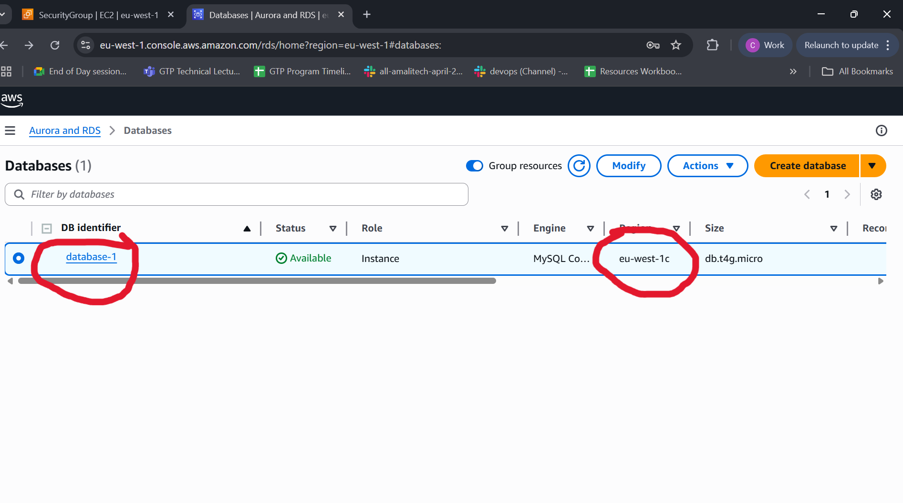
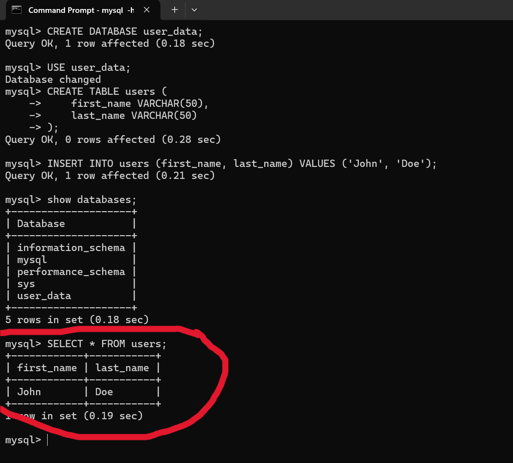
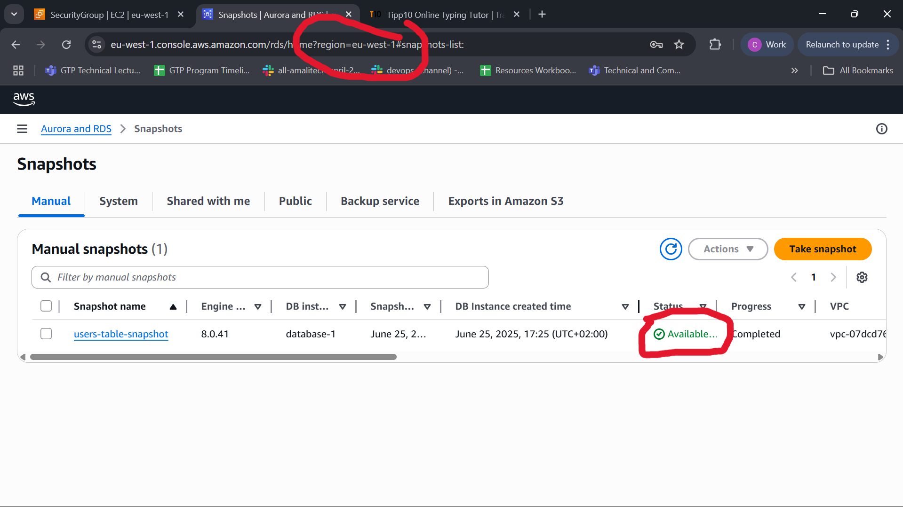
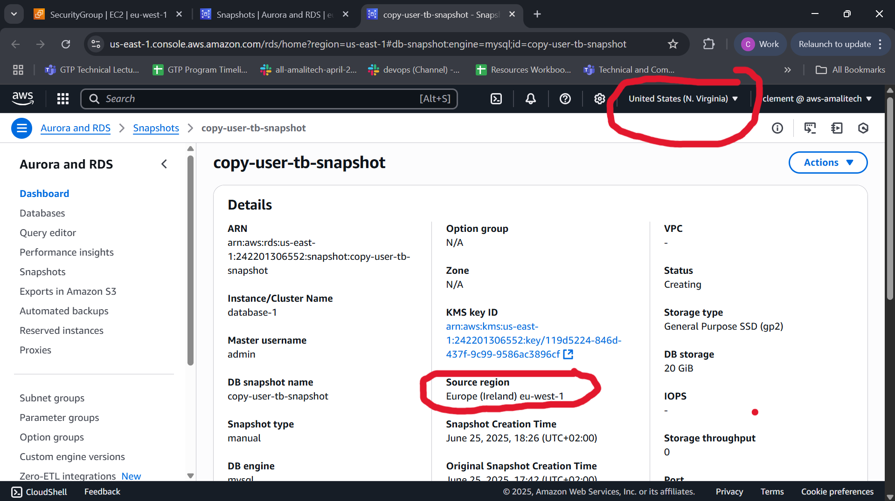
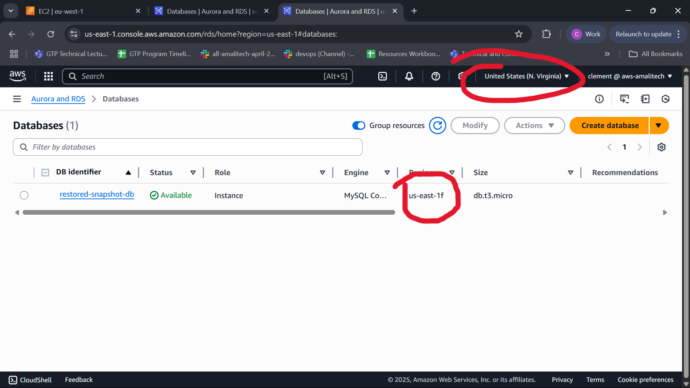
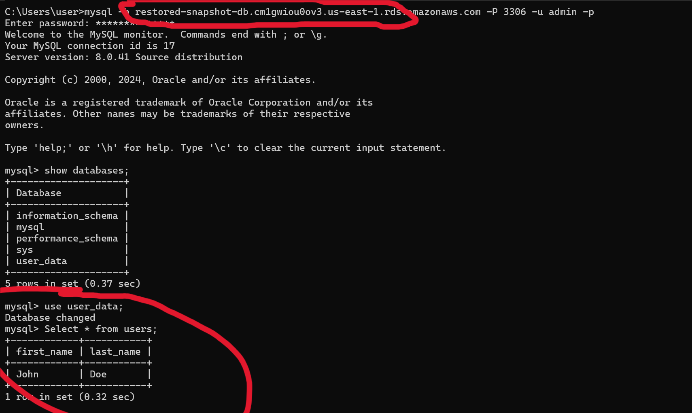

# RDS Snapshot Replication Across AWS Regions

## 📋 Overview

This repository demonstrates the complete process of creating, copying, and restoring Amazon RDS snapshots across different AWS regions. This lab showcases disaster recovery and data replication capabilities using AWS RDS snapshot functionality.

## 🎯 Objectives

By completing this lab, I have successfully:

- ✅ Created an Amazon RDS Manual Snapshot
- ✅ Copied the snapshot to another AWS region
- ✅ Restored the snapshot to create a replica database
- ✅ Verified data integrity in the replicated database

## 🔧 Prerequisites

- AWS account with permissions for RDS, IAM, and S3
- Existing RDS instance (MySQL, PostgreSQL, or MariaDB)
- AWS Management Console access

## 🚀 Implementation Steps

### Step 1: Initial Database Setup

First, I created an RDS instance and added some sample data to demonstrate the replication process.


*Original RDS database instance*


*Sample data inserted into the original database*

### Step 2: Create RDS Manual Snapshot

1. Navigate to Amazon RDS in the AWS Management Console
2. Select the target RDS instance
3. Click **Actions** → **Take Snapshot**
4. Enter a descriptive snapshot name
5. Click **Create Snapshot**
6. Wait for the snapshot status to change to "Available"


*Successfully created RDS snapshot showing "Available" status*

### Step 3: Copy Snapshot to Another AWS Region

1. In the RDS Console, navigate to **Snapshots**
2. Select the created snapshot
3. Click **Actions** → **Copy Snapshot**
4. Configure the copy settings:
   - **Destination Region**: Select target AWS region
   - **Snapshot Name**: Enter a descriptive name for the copy
   - **Encryption**: Configure as needed
5. Click **Copy Snapshot**
6. Wait for the status to change to "Available" in the destination region


*Snapshot successfully copied to the destination region*

### Step 4: Restore Snapshot in Target Region

1. Switch to the target AWS region in the console
2. Navigate to **RDS** → **Snapshots**
3. Find the copied snapshot
4. Click **Actions** → **Restore Snapshot**
5. Configure the restored database:
   - **DB Instance Identifier**: Unique identifier for the replica
   - **Instance Type**: Appropriate size for your needs
   - **VPC & Security Groups**: Ensure correct network settings
6. Click **Restore DB Instance**
7. Wait for the status to change to "Available"


*New database instance restored from the copied snapshot*

### Step 5: Verify Data Integrity

After the restoration process completed, I verified that all data was successfully replicated by connecting to the new database instance and checking the data.


*Verification showing the same data exists in the restored database*

## ✅ Results

The lab was completed successfully with the following outcomes:

1. **Snapshot Creation**: ✅ Manual snapshot created from the original RDS instance
2. **Cross-Region Copy**: ✅ Snapshot successfully copied to a different AWS region
3. **Database Restoration**: ✅ New RDS instance restored from the copied snapshot
4. **Data Verification**: ✅ All original data preserved and accessible in the replica

## 🔍 Key Learnings

- **Disaster Recovery**: RDS snapshots provide an effective way to create point-in-time backups
- **Cross-Region Replication**: Snapshots can be copied across regions for geographic redundancy
- **Data Integrity**: The restoration process maintains complete data integrity
- **Scalability**: This process can be automated for regular backup and replication schedules

## 🛠️ Alternative Methods

### AWS CLI Commands

For automation, the same process can be accomplished using AWS CLI:

```bash
# Create snapshot
aws rds create-db-snapshot \
    --db-instance-identifier your-db-instance \
    --db-snapshot-identifier your-snapshot-name

# Copy snapshot to another region
aws rds copy-db-snapshot \
    --source-db-snapshot-identifier arn:aws:rds:source-region:account:snapshot:snapshot-name \
    --target-db-snapshot-identifier copied-snapshot-name \
    --source-region source-region \
    --destination-region target-region

# Restore from snapshot
aws rds restore-db-instance-from-db-snapshot \
    --db-instance-identifier restored-instance-name \
    --db-snapshot-identifier copied-snapshot-name \
    --region target-region
```

## 🧹 Cleanup

To avoid unnecessary charges, remember to clean up resources:

```bash
# Delete the restored instance
aws rds delete-db-instance \
    --db-instance-identifier restored-instance-name \
    --skip-final-snapshot

# Delete snapshots
aws rds delete-db-snapshot \
    --db-snapshot-identifier snapshot-name
```

## 📈 Best Practices

1. **Regular Snapshots**: Implement automated snapshot schedules for production databases
2. **Cross-Region Strategy**: Maintain snapshots in multiple regions for disaster recovery
3. **Encryption**: Enable encryption for snapshots containing sensitive data
4. **Monitoring**: Set up CloudWatch alarms for snapshot creation and copy operations
5. **Testing**: Regularly test restoration procedures to ensure data recoverability

## 🔗 Additional Resources

- [AWS RDS User Guide](https://docs.aws.amazon.com/rds/)
- [RDS Snapshot Documentation](https://docs.aws.amazon.com/AmazonRDS/latest/UserGuide/USER_CreateSnapshot.html)
- [Cross-Region Snapshot Copy](https://docs.aws.amazon.com/AmazonRDS/latest/UserGuide/USER_CopySnapshot.html)

---

**Lab Completed**: June 26, 2025  
**Status**: ✅ Successful  
**Duration**: ~45 minutes