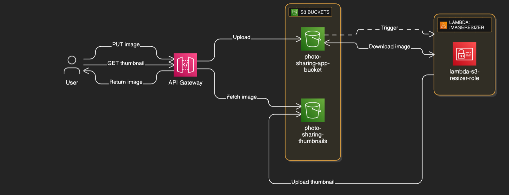
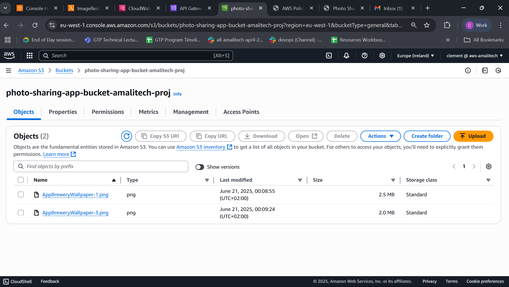
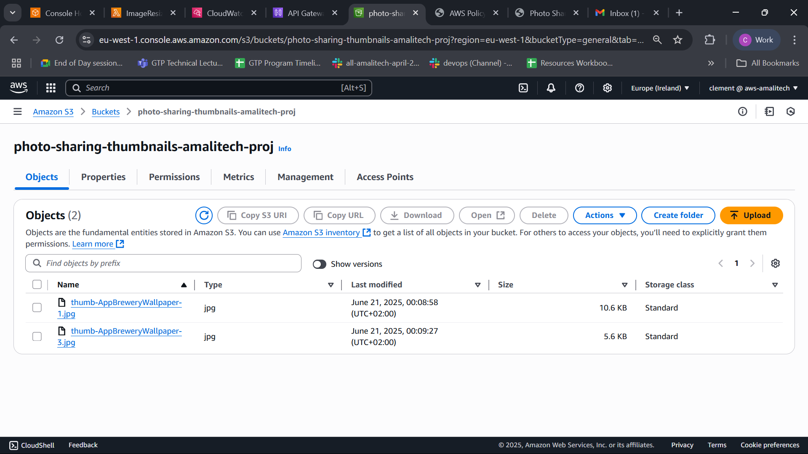
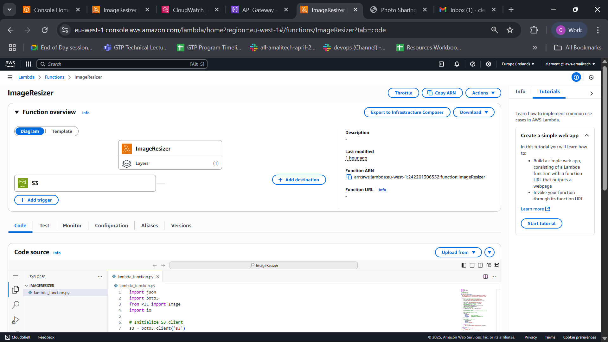
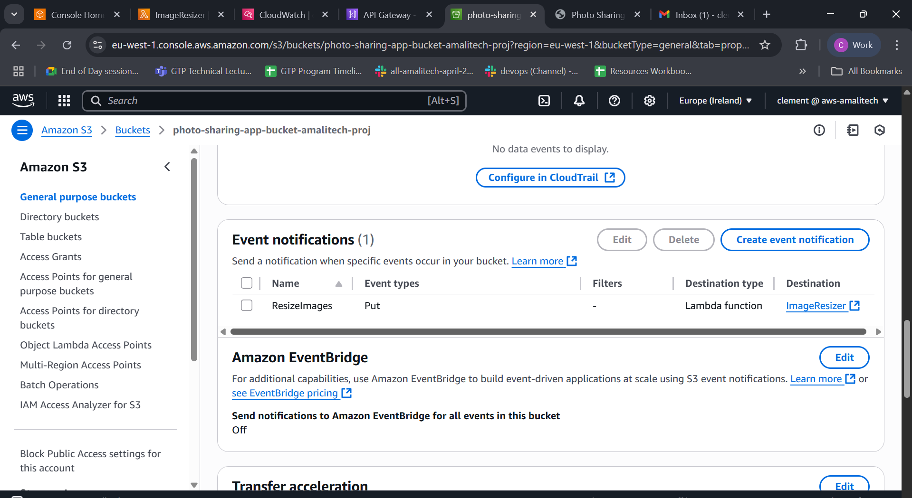
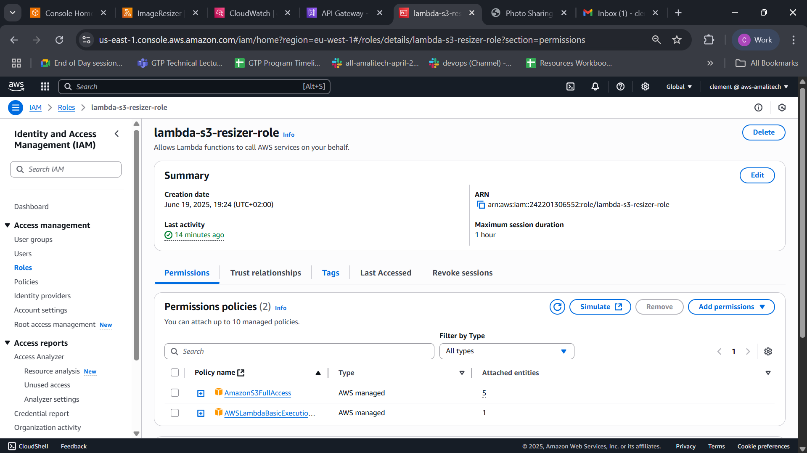
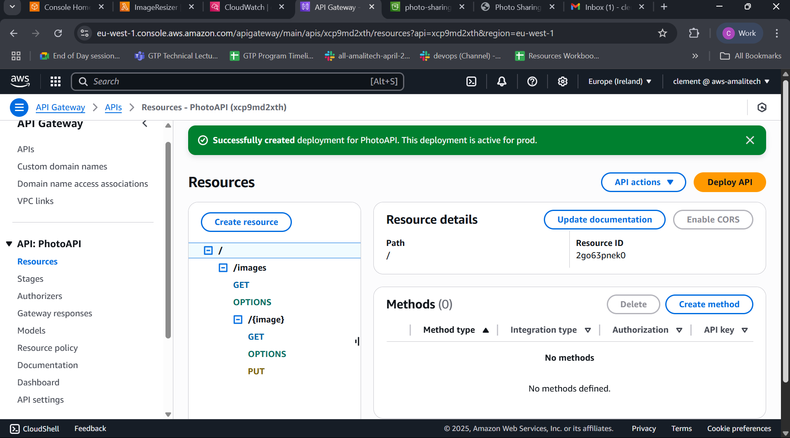
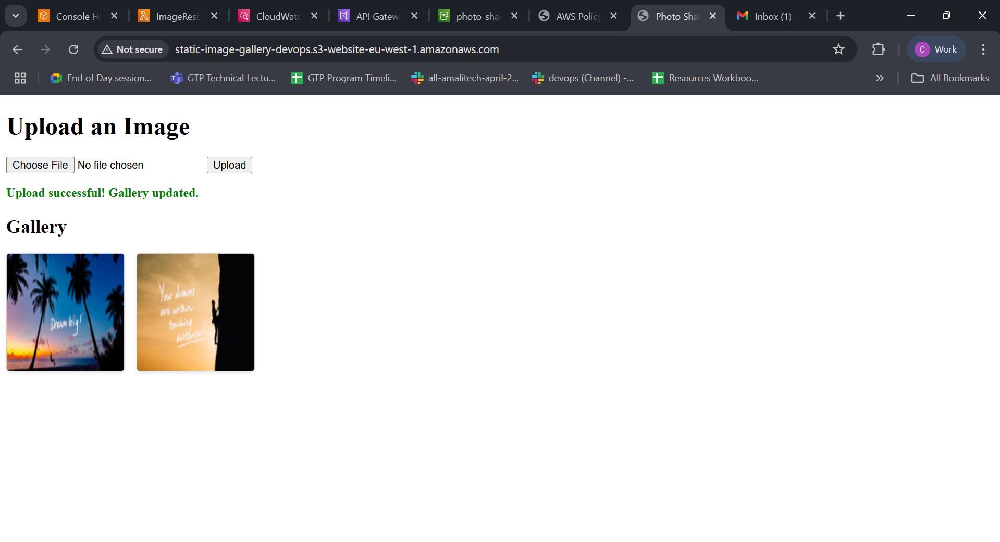
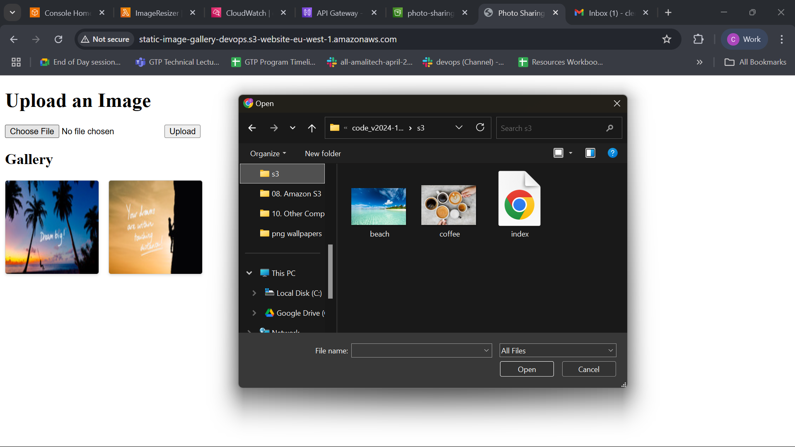

# AWS Serverless Photo Sharing Application

## Project Overview

This project is a modern, serverless photo sharing application built using AWS cloud services. It allows users to upload images through a simple web interface, automatically generates thumbnails, and displays them in a gallery. The architecture leverages several AWS services to create a scalable, maintenance-free solution:

- **Amazon S3** for storing original images and thumbnails
- **AWS Lambda** for automated image processing
- **Amazon API Gateway** for secure API endpoints
- **AWS IAM** for secure service permissions

👉 [View Project Guide PDF](https://drive.google.com/file/d/1kArnSENZK9V2oFj01q8QF2zd3txkeY4n/view?usp=sharing)

👉 [Visit Live Demo](http://static-image-gallery-devops.s3-website-eu-west-1.amazonaws.com/) 😊

## System Architecture

The diagram above illustrates the flow of data through the application:

1. User uploads an image through the web interface, which sends a PUT request to API Gateway
2. API Gateway forwards the image to the original images S3 bucket
3. S3 bucket triggers a Lambda function when a new image is uploaded
4. Lambda function:
    - Downloads the original image
    - Resizes it to create a thumbnail (150x150 pixels)
    - Uploads the thumbnail to the thumbnails S3 bucket
5. User views thumbnails in the gallery, which are served through API Gateway

## Implementation Details

### S3 Buckets Setup

Two S3 buckets were created for this application:

The first bucket stores the original uploaded images. It's configured with an event trigger that activates whenever new content is added.

The second bucket stores the automatically generated thumbnails. These are smaller versions of the original images, optimized for quick loading in the gallery view.

### Lambda Function Configuration

The Lambda function is the core of our application's image processing capability. Written in Python, it uses the PIL (Python Imaging Library) to resize images. Key improvements I've implemented:

- **RGB and RGBA Format Handling**: Enhanced the function to properly handle both RGB and RGBA image formats, preventing color distortion in thumbnails
- **Error Handling**: Implemented robust error handling for various image formats and edge cases
- **MIME Type Preservation**: Ensured proper content type is set when saving thumbnails

### Event Trigger Setup

An S3 event notification is configured to trigger the Lambda function whenever a new image is uploaded to the original images bucket. This creates a seamless automation flow without any manual intervention required.

### IAM Role for Lambda

A dedicated IAM role was created to grant the Lambda function necessary permissions

### API Gateway Configuration

API Gateway provides HTTP endpoints for:

- Uploading images (PUT)
- Retrieving thumbnails (GET)
- Fetching all thumbnails (GET)

The API is configured to interact directly with S3, making the solution highly efficient.

## Front-End Implementation

The front-end is a simple HTML/JavaScript application that provides:

- File selection and upload functionality
- Gallery view of all thumbnails
- Responsive design for various screen sizes

### Key Front-End Improvements

I've implemented several enhancements to improve the user experience:

1. **Auto-Refreshing Gallery**: After upload, the gallery automatically refreshes to show the new image
2. **Robust Retry Logic**: Implemented retry mechanism to handle S3's eventual consistency
3. **Improved Error Handling**: Clear user feedback for various error scenarios
4. **Upload Status Indicators**: Visual feedback during the upload process
5. **Cache Busting**: Ensures fresh images are always retrieved from the server

### Upload Process

The upload process is straightforward:

1. User selects an image file
2. Application sanitizes the filename and sends it directly to S3 via API Gateway
3. Status updates are shown to the user during the upload process
4. Upon successful upload, the gallery refreshes to display the new thumbnail

## Technical Challenges and Solutions

### Challenge 1: Image Format Compatibility

**Problem**: The Lambda function was initially failing with RGBA images (PNGs with transparency).

**Solution**: Enhanced the Lambda function to detect the image mode and handle both RGB and RGBA formats appropriately.

### Challenge 2: S3 Eventual Consistency

**Problem**: Newly uploaded images wouldn't appear immediately in the gallery.

**Solution**: Implemented a progressive retry mechanism in the front-end that attempts to refresh the gallery multiple times after an upload.

### Challenge 3: Browser Caching

**Problem**: Browsers would cache the gallery list, preventing users from seeing updates.

**Solution**: Added cache-busting parameters to API requests to ensure fresh data is always retrieved.

### Challenge 4: Filename Spaces Issue

**Problem**: Photos with spaces in their names caused errors in the Lambda function. For some reason, spaces were being replaced with '+' characters, causing file retrieval failures.

**Solution**: Had to implement filename sanitization to remove or replace spaces before upload. Monitored CloudWatch logs to identify and troubleshoot these Lambda function errors, which saved significant debugging time.

## Conclusion

This serverless photo sharing application demonstrates the power of AWS cloud services working together to create a scalable solution without managing any servers. The combination of S3, Lambda, and API Gateway provides:

- **Scalability**: Handles any number of simultaneous uploads
- **Cost Efficiency**: Pay only for actual usage
- **Low Maintenance**: No servers to manage or update
- **High Reliability**: Leverages AWS's robust infrastructure

The application successfully meets all requirements while providing a smooth user experience with the added enhancements to both the backend Lambda function and front-end interface.
