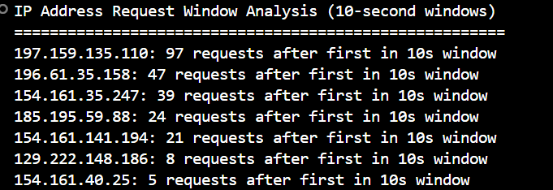
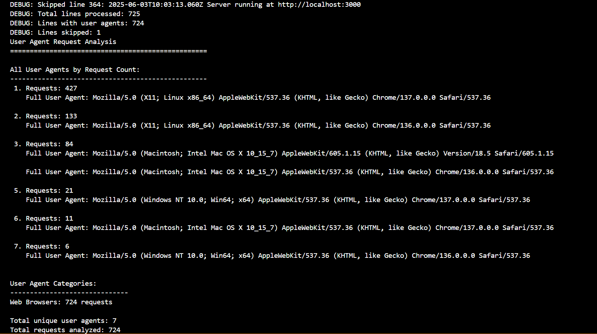
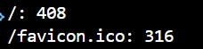

# Log Analysis Scripts

Three Python scripts for analyzing web server logs with efficient, single-pass algorithms.

## Scripts Overview

### 1. `ip_burst_analyzer.py`

**Purpose:** Analyzes IP request burst patterns within 10-second windows

**What it does:**

- Identifies how many requests came after the first request for each IP within 10-second timeframes
- Detects potential burst activity or rapid-fire requests from the same source
- Handles multiple timestamp formats (Apache, ISO, US formats)



**Output:** Shows IPs with highest burst activity and the maximum number of follow-up requests in any 10-second window

### 2. `user_agent_counter.py`

**Purpose:** Counts and categorizes requests by user agent types

**What it does:**

- Extracts user agent strings from log entries
- Counts requests per unique user agent
- Categorizes agents into types: Web Browsers, Bots/Crawlers, Mobile Devices, API/Tools, etc.
- Shows complete user agent strings to identify differences between similar entries



**Output:** Lists all user agents with request counts plus categorized summary statistics

### 3. `endpoint_counter.py`

**Purpose:** Tracks endpoint access frequency

**What it does:**

- Extracts HTTP endpoints/paths from log entries
- Counts how many times each endpoint was accessed
- Simple, efficient counting with sorted results



**Output:** Lists all endpoints sorted by access frequency (most accessed first)

## Usage

All scripts work with the included `NodeJsApp.log` file: (Note: you can also use python3 if you prefer)

```bash
python ip_burst_analyzer.py
python user_agent_counter.py  
python endpoint_counter.py
```

## Key Features

- **Single-pass efficiency:** Each script reads the log file only once
- **Regex-based parsing:** Handles various log formats reliably
- **Dictionary counting:** Fast key-value counting without redundant checks
- **Sorted outputs:** Results ordered by relevance (frequency, burst activity)
- **Error handling:** Graceful handling of malformed log entries

## Log File Format

Scripts are designed to work with standard web server logs (Apache/Nginx format) containing:

- IP addresses (IPv4 and IPv6)
- Timestamps
- HTTP methods and endpoints
- User agent strings

Perfect for analyzing traffic patterns, detecting unusual activity, and understanding endpoint usage.
